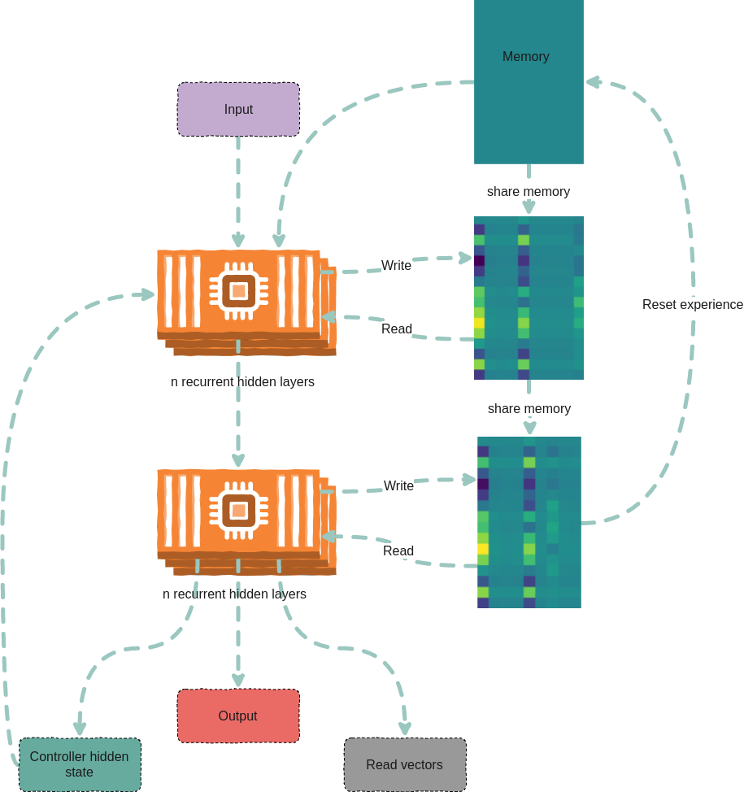

# Differentiable Neural Computers and family, for Pytorch

Includes:
1. Differentiable Neural Computers (DNC)
2. Sparse Access Memory (SAM)
3. Sparse Differentiable Neural Computers (SDNC)

<!-- START doctoc generated TOC please keep comment here to allow auto update -->
<!-- DON'T EDIT THIS SECTION, INSTEAD RE-RUN doctoc TO UPDATE -->


- [Install](#install)
  - [From source](#from-source)
- [Architecure](#architecure)
- [Usage](#usage)
  - [DNC](#dnc)
    - [Example usage](#example-usage)
    - [Debugging](#debugging)
  - [SDNC](#sdnc)
    - [Example usage](#example-usage-1)
    - [Debugging](#debugging-1)
  - [SAM](#sam)
    - [Example usage](#example-usage-2)
    - [Debugging](#debugging-2)
- [Example copy task](#example-copy-task)
- [General noteworthy stuff](#general-noteworthy-stuff)

<!-- END doctoc generated TOC please keep comment here to allow auto update -->

[](https://travis-ci.org/ixaxaar/pytorch-dnc) [](https://badge.fury.io/py/dnc)

This is an implementation of [Differentiable Neural Computers](http://people.idsia.ch/~rupesh/rnnsymposium2016/slides/graves.pdf), described in the paper [Hybrid computing using a neural network with dynamic external memory, Graves et al.](https://www.nature.com/articles/nature20101)
and Sparse DNCs (SDNCs) and Sparse Access Memory (SAM) described in [Scaling Memory-Augmented Neural Networks with Sparse Reads and Writes](http://papers.nips.cc/paper/6298-scaling-memory-augmented-neural-networks-with-sparse-reads-and-writes.pdf).

## Install

```bash
pip install dnc
```

### From source

```
git clone https://github.com/ixaxaar/pytorch-dnc
cd pytorch-dnc
pip install -r ./requirements.txt
pip install -e .
```

`pytest` is required to run the test

## Architecure



## Usage

### DNC

**Constructor Parameters**:

Following are the constructor parameters:

Following are the constructor parameters:

| Argument | Default | Description |
| --- | --- | --- |
| input_size | `None` | Size of the input vectors |
| hidden_size | `None` | Size of hidden units |
| rnn_type | `'lstm'` | Type of recurrent cells used in the controller |
| num_layers | `1` | Number of layers of recurrent units in the controller |
| num_hidden_layers | `2` | Number of hidden layers per layer of the controller |
| bias | `True` | Bias |
| batch_first | `True` | Whether data is fed batch first |
| dropout | `0` | Dropout between layers in the controller |
| bidirectional | `False` | If the controller is bidirectional (Not yet implemented |
| nr_cells | `5` | Number of memory cells |
| read_heads | `2` | Number of read heads |
| cell_size | `10` | Size of each memory cell |
| nonlinearity | `'tanh'` | If using 'rnn' as `rnn_type`, non-linearity of the RNNs |
| gpu_id | `-1` | ID of the GPU, -1 for CPU |
| independent_linears | `False` | Whether to use independent linear units to derive interface vector |
| share_memory | `True` | Whether to share memory between controller layers |

Following are the forward pass parameters:

| Argument | Default | Description |
| --- | --- | --- |
| input | - | The input vector `(B*T*X)` or `(T*B*X)` |
| hidden | `(None,None,None)` | Hidden states `(controller hidden, memory hidden, read vectors)` |
| reset_experience | `False` | Whether to reset memory |
| pass_through_memory | `True` | Whether to pass through memory |


#### Example usage

```python
from dnc import DNC

rnn = DNC(
  input_size=64,
  hidden_size=128,
  rnn_type='lstm',
  num_layers=4,
  nr_cells=100,
  cell_size=32,
  read_heads=4,
  batch_first=True,
  gpu_id=0
)

(controller_hidden, memory, read_vectors) = (None, None, None)

output, (controller_hidden, memory, read_vectors) = \
  rnn(torch.randn(10, 4, 64), (controller_hidden, memory, read_vectors, reset_experience=True))
```


#### Debugging

The `debug` option causes the network to return its memory hidden vectors (numpy `ndarray`s) for the first batch each forward step.
These vectors can be analyzed or visualized, using visdom for example.

```python
from dnc import DNC

rnn = DNC(
  input_size=64,
  hidden_size=128,
  rnn_type='lstm',
  num_layers=4,
  nr_cells=100,
  cell_size=32,
  read_heads=4,
  batch_first=True,
  gpu_id=0,
  debug=True
)

(controller_hidden, memory, read_vectors) = (None, None, None)

output, (controller_hidden, memory, read_vectors), debug_memory = \
  rnn(torch.randn(10, 4, 64), (controller_hidden, memory, read_vectors, reset_experience=True))
```

Memory vectors returned by forward pass (`np.ndarray`):

| Key | Y axis (dimensions) | X axis (dimensions) |
| --- | --- | --- |
| `debug_memory['memory']` | layer * time | nr_cells * cell_size
| `debug_memory['link_matrix']` | layer * time | nr_cells * nr_cells
| `debug_memory['precedence']` | layer * time | nr_cells
| `debug_memory['read_weights']` | layer * time | read_heads * nr_cells
| `debug_memory['write_weights']` | layer * time | nr_cells
| `debug_memory['usage_vector']` | layer * time | nr_cells


### SDNC

**Constructor Parameters**:

Following are the constructor parameters:

| Argument | Default | Description |
| --- | --- | --- |
| input_size | `None` | Size of the input vectors |
| hidden_size | `None` | Size of hidden units |
| rnn_type | `'lstm'` | Type of recurrent cells used in the controller |
| num_layers | `1` | Number of layers of recurrent units in the controller |
| num_hidden_layers | `2` | Number of hidden layers per layer of the controller |
| bias | `True` | Bias |
| batch_first | `True` | Whether data is fed batch first |
| dropout | `0` | Dropout between layers in the controller |
| bidirectional | `False` | If the controller is bidirectional (Not yet implemented |
| nr_cells | `5000` | Number of memory cells |
| read_heads | `4` | Number of read heads |
| sparse_reads | `4` | Number of sparse memory reads per read head |
| temporal_reads | `4` | Number of temporal reads |
| cell_size | `10` | Size of each memory cell |
| nonlinearity | `'tanh'` | If using 'rnn' as `rnn_type`, non-linearity of the RNNs |
| gpu_id | `-1` | ID of the GPU, -1 for CPU |
| independent_linears | `False` | Whether to use independent linear units to derive interface vector |
| share_memory | `True` | Whether to share memory between controller layers |

Following are the forward pass parameters:

| Argument | Default | Description |
| --- | --- | --- |
| input | - | The input vector `(B*T*X)` or `(T*B*X)` |
| hidden | `(None,None,None)` | Hidden states `(controller hidden, memory hidden, read vectors)` |
| reset_experience | `False` | Whether to reset memory |
| pass_through_memory | `True` | Whether to pass through memory |


#### Example usage

```python
from dnc import SDNC

rnn = SDNC(
  input_size=64,
  hidden_size=128,
  rnn_type='lstm',
  num_layers=4,
  nr_cells=100,
  cell_size=32,
  read_heads=4,
  sparse_reads=4,
  batch_first=True,
  gpu_id=0
)

(controller_hidden, memory, read_vectors) = (None, None, None)

output, (controller_hidden, memory, read_vectors) = \
  rnn(torch.randn(10, 4, 64), (controller_hidden, memory, read_vectors, reset_experience=True))
```


#### Debugging

The `debug` option causes the network to return its memory hidden vectors (numpy `ndarray`s) for the first batch each forward step.
These vectors can be analyzed or visualized, using visdom for example.

```python
from dnc import SDNC

rnn = SDNC(
  input_size=64,
  hidden_size=128,
  rnn_type='lstm',
  num_layers=4,
  nr_cells=100,
  cell_size=32,
  read_heads=4,
  batch_first=True,
  sparse_reads=4,
  temporal_reads=4,
  gpu_id=0,
  debug=True
)

(controller_hidden, memory, read_vectors) = (None, None, None)

output, (controller_hidden, memory, read_vectors), debug_memory = \
  rnn(torch.randn(10, 4, 64), (controller_hidden, memory, read_vectors, reset_experience=True))
```

Memory vectors returned by forward pass (`np.ndarray`):

| Key | Y axis (dimensions) | X axis (dimensions) |
| --- | --- | --- |
| `debug_memory['memory']` | layer * time | nr_cells * cell_size
| `debug_memory['visible_memory']` | layer * time | sparse_reads+2*temporal_reads+1 * nr_cells
| `debug_memory['read_positions']` | layer * time | sparse_reads+2*temporal_reads+1
| `debug_memory['link_matrix']` | layer * time | sparse_reads+2*temporal_reads+1 * sparse_reads+2*temporal_reads+1
| `debug_memory['rev_link_matrix']` | layer * time | sparse_reads+2*temporal_reads+1 * sparse_reads+2*temporal_reads+1
| `debug_memory['precedence']` | layer * time | nr_cells
| `debug_memory['read_weights']` | layer * time | read_heads * nr_cells
| `debug_memory['write_weights']` | layer * time | nr_cells
| `debug_memory['usage']` | layer * time | nr_cells

### SAM

**Constructor Parameters**:

Following are the constructor parameters:

| Argument | Default | Description |
| --- | --- | --- |
| input_size | `None` | Size of the input vectors |
| hidden_size | `None` | Size of hidden units |
| rnn_type | `'lstm'` | Type of recurrent cells used in the controller |
| num_layers | `1` | Number of layers of recurrent units in the controller |
| num_hidden_layers | `2` | Number of hidden layers per layer of the controller |
| bias | `True` | Bias |
| batch_first | `True` | Whether data is fed batch first |
| dropout | `0` | Dropout between layers in the controller |
| bidirectional | `False` | If the controller is bidirectional (Not yet implemented |
| nr_cells | `5000` | Number of memory cells |
| read_heads | `4` | Number of read heads |
| sparse_reads | `4` | Number of sparse memory reads per read head |
| cell_size | `10` | Size of each memory cell |
| nonlinearity | `'tanh'` | If using 'rnn' as `rnn_type`, non-linearity of the RNNs |
| gpu_id | `-1` | ID of the GPU, -1 for CPU |
| independent_linears | `False` | Whether to use independent linear units to derive interface vector |
| share_memory | `True` | Whether to share memory between controller layers |

Following are the forward pass parameters:

| Argument | Default | Description |
| --- | --- | --- |
| input | - | The input vector `(B*T*X)` or `(T*B*X)` |
| hidden | `(None,None,None)` | Hidden states `(controller hidden, memory hidden, read vectors)` |
| reset_experience | `False` | Whether to reset memory |
| pass_through_memory | `True` | Whether to pass through memory |


#### Example usage

```python
from dnc import SAM

rnn = SAM(
  input_size=64,
  hidden_size=128,
  rnn_type='lstm',
  num_layers=4,
  nr_cells=100,
  cell_size=32,
  read_heads=4,
  sparse_reads=4,
  batch_first=True,
  gpu_id=0
)

(controller_hidden, memory, read_vectors) = (None, None, None)

output, (controller_hidden, memory, read_vectors) = \
  rnn(torch.randn(10, 4, 64), (controller_hidden, memory, read_vectors, reset_experience=True))
```


#### Debugging

The `debug` option causes the network to return its memory hidden vectors (numpy `ndarray`s) for the first batch each forward step.
These vectors can be analyzed or visualized, using visdom for example.

```python
from dnc import SAM

rnn = SAM(
  input_size=64,
  hidden_size=128,
  rnn_type='lstm',
  num_layers=4,
  nr_cells=100,
  cell_size=32,
  read_heads=4,
  batch_first=True,
  sparse_reads=4,
  gpu_id=0,
  debug=True
)

(controller_hidden, memory, read_vectors) = (None, None, None)

output, (controller_hidden, memory, read_vectors), debug_memory = \
  rnn(torch.randn(10, 4, 64), (controller_hidden, memory, read_vectors, reset_experience=True))
```

Memory vectors returned by forward pass (`np.ndarray`):

| Key | Y axis (dimensions) | X axis (dimensions) |
| --- | --- | --- |
| `debug_memory['memory']` | layer * time | nr_cells * cell_size
| `debug_memory['visible_memory']` | layer * time | sparse_reads+2*temporal_reads+1 * nr_cells
| `debug_memory['read_positions']` | layer * time | sparse_reads+2*temporal_reads+1
| `debug_memory['read_weights']` | layer * time | read_heads * nr_cells
| `debug_memory['write_weights']` | layer * time | nr_cells
| `debug_memory['usage']` | layer * time | nr_cells


## Example copy task

The copy task, as descibed in the original paper, is included in the repo.

From the project root:
```bash
python ./tasks/copy_task.py -cuda 0 -optim rmsprop -batch_size 32 -mem_slot 64 # (like original implementation)

python3 ./tasks/copy_task.py -cuda 0 -lr 0.001 -rnn_type lstm -nlayer 1 -nhlayer 2 -dropout 0 -mem_slot 32 -batch_size 1000 -optim adam -sequence_max_length 8 # (faster convergence)

For SDNCs:
python3 -B ./tasks/copy_task.py -cuda 0 -lr 0.001 -rnn_type lstm -memory_type sdnc -nlayer 1 -nhlayer 2 -dropout 0 -mem_slot 100 -mem_size 10  -read_heads 1 -sparse_reads 10 -batch_size 20 -optim adam -sequence_max_length 10

and for curriculum learning for SDNCs:
python3 -B ./tasks/copy_task.py -cuda 0 -lr 0.001 -rnn_type lstm -memory_type sdnc -nlayer 1 -nhlayer 2 -dropout 0 -mem_slot 100 -mem_size 10  -read_heads 1 -sparse_reads 4 -temporal_reads 4 -batch_size 20 -optim adam -sequence_max_length 4 -curriculum_increment 2 -curriculum_freq 10000
```

For the full set of options, see:
```
python ./tasks/copy_task.py --help
```

The copy task can be used to debug memory using [Visdom](https://github.com/facebookresearch/visdom).

Additional step required:

```bash
pip install visdom
python -m visdom.server
```

Open http://localhost:8097/ on your browser, and execute the copy task:

```bash
python ./tasks/copy_task.py -cuda 0
```

The visdom dashboard shows memory as a heatmap for batch 0 every `-summarize_freq` iteration:


## General noteworthy stuff

1. SDNCs use the [FLANN approximate nearest library](https://www.cs.ubc.ca/research/flann/), with its python binding [pyflann3](https://github.com/primetang/pyflann).

FLANN can be installed either from pip (automatically as a dependency), or from source (e.g. for multithreading via OpenMP):

```bash
# install openmp first: e.g. `sudo pacman -S openmp` for Arch.
git clone git://github.com/mariusmuja/flann.git
cd flann
mkdir build
cd build
cmake ..
make -j 4
sudo make install
```

2. An alternative to FLANN is [FAISS](https://github.com/facebookresearch/faiss), which is much faster and interoperable with torch cuda tensors (but is difficult to distribute, see [dnc/faiss_index.py](dnc/faiss_index.py)).
3. `nan`s in the gradients are common, try with different batch sizes

Repos referred to for creation of this repo:

- [deepmind/dnc](https://github.com/deepmind/dnc)
- [ypxie/pytorch-NeuCom](https://github.com/ypxie/pytorch-NeuCom)
- [jingweiz/pytorch-dnc](https://github.com/jingweiz/pytorch-dnc)

