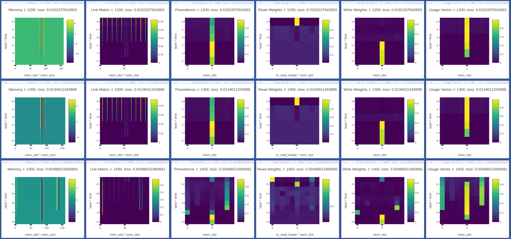

Differentiable Neural Computers and family, for Pytorch
=======================================================

Includes: 1. Differentiable Neural Computers (DNC) 2. Sparse Access
Memory (SAM) 3. Sparse Differentiable Neural Computers (SDNC)

.. raw:: html

   <!-- START doctoc generated TOC please keep comment here to allow auto update -->

.. raw:: html

   <!-- DON'T EDIT THIS SECTION, INSTEAD RE-RUN doctoc TO UPDATE -->

-  `Install <#install>`__
-  `From source <#from-source>`__
-  `Architecure <#architecure>`__
-  `Usage <#usage>`__
-  `DNC <#dnc>`__

   -  `Example usage <#example-usage>`__
   -  `Debugging <#debugging>`__

-  `SDNC <#sdnc>`__

   -  `Example usage <#example-usage-1>`__
   -  `Debugging <#debugging-1>`__

-  `SAM <#sam>`__

   -  `Example usage <#example-usage-2>`__
   -  `Debugging <#debugging-2>`__

-  `Tasks <#tasks>`__
-  `Copy task (with curriculum and
   generalization) <#copy-task-with-curriculum-and-generalization>`__
-  `Generalizing Addition task <#generalizing-addition-task>`__
-  `Generalizing Argmax task <#generalizing-argmax-task>`__
-  `Code Structure <#code-structure>`__
-  `General noteworthy stuff <#general-noteworthy-stuff>`__

.. raw:: html

   <!-- END doctoc generated TOC please keep comment here to allow auto update -->

|Build Status| |PyPI version|

This is an implementation of `Differentiable Neural
Computers <http://people.idsia.ch/~rupesh/rnnsymposium2016/slides/graves.pdf>`__,
described in the paper `Hybrid computing using a neural network with
dynamic external memory, Graves et
al. <https://www.nature.com/articles/nature20101>`__ and Sparse DNCs
(SDNCs) and Sparse Access Memory (SAM) described in `Scaling
Memory-Augmented Neural Networks with Sparse Reads and
Writes <http://papers.nips.cc/paper/6298-scaling-memory-augmented-neural-networks-with-sparse-reads-and-writes.pdf>`__.

Install
-------

.. code:: bash

    pip install dnc

From source
~~~~~~~~~~~

::

    git clone https://github.com/ixaxaar/pytorch-dnc
    cd pytorch-dnc
    pip install -r ./requirements.txt
    pip install -e .

For using fully GPU based SDNCs or SAMs, install FAISS:

.. code:: bash

    conda install faiss-gpu -c pytorch

``pytest`` is required to run the test

Architecure
-----------

Usage
-----

DNC
~~~

**Constructor Parameters**:

Following are the constructor parameters:

Following are the constructor parameters:

+------+------+------+
| Argu | Defa | Desc |
| ment | ult  | ript |
|      |      | ion  |
+======+======+======+
| inpu | ``No | Size |
| t\_s | ne`` | of   |
| ize  |      | the  |
|      |      | inpu |
|      |      | t    |
|      |      | vect |
|      |      | ors  |
+------+------+------+
| hidd | ``No | Size |
| en\_ | ne`` | of   |
| size |      | hidd |
|      |      | en   |
|      |      | unit |
|      |      | s    |
+------+------+------+
| rnn\ | ``'l | Type |
| _typ | stm' | of   |
| e    | ``   | recu |
|      |      | rren |
|      |      | t    |
|      |      | cell |
|      |      | s    |
|      |      | used |
|      |      | in   |
|      |      | the  |
|      |      | cont |
|      |      | roll |
|      |      | er   |
+------+------+------+
| num\ | ``1` | Numb |
| _lay | `    | er   |
| ers  |      | of   |
|      |      | laye |
|      |      | rs   |
|      |      | of   |
|      |      | recu |
|      |      | rren |
|      |      | t    |
|      |      | unit |
|      |      | s    |
|      |      | in   |
|      |      | the  |
|      |      | cont |
|      |      | roll |
|      |      | er   |
+------+------+------+
| num\ | ``2` | Numb |
| _hid | `    | er   |
| den\ |      | of   |
| _lay |      | hidd |
| ers  |      | en   |
|      |      | laye |
|      |      | rs   |
|      |      | per  |
|      |      | laye |
|      |      | r    |
|      |      | of   |
|      |      | the  |
|      |      | cont |
|      |      | roll |
|      |      | er   |
+------+------+------+
| bias | ``Tr | Bias |
|      | ue`` |      |
+------+------+------+
| batc | ``Tr | Whet |
| h\_f | ue`` | her  |
| irst |      | data |
|      |      | is   |
|      |      | fed  |
|      |      | batc |
|      |      | h    |
|      |      | firs |
|      |      | t    |
+------+------+------+
| drop | ``0` | Drop |
| out  | `    | out  |
|      |      | betw |
|      |      | een  |
|      |      | laye |
|      |      | rs   |
|      |      | in   |
|      |      | the  |
|      |      | cont |
|      |      | roll |
|      |      | er   |
+------+------+------+
| bidi | ``Fa | If   |
| rect | lse` | the  |
| iona | `    | cont |
| l    |      | roll |
|      |      | er   |
|      |      | is   |
|      |      | bidi |
|      |      | rect |
|      |      | iona |
|      |      | l    |
|      |      | (Not |
|      |      | yet  |
|      |      | impl |
|      |      | emen |
|      |      | ted  |
+------+------+------+
| nr\_ | ``5` | Numb |
| cell | `    | er   |
| s    |      | of   |
|      |      | memo |
|      |      | ry   |
|      |      | cell |
|      |      | s    |
+------+------+------+
| read | ``2` | Numb |
| \_he | `    | er   |
| ads  |      | of   |
|      |      | read |
|      |      | head |
|      |      | s    |
+------+------+------+
| cell | ``10 | Size |
| \_si | ``   | of   |
| ze   |      | each |
|      |      | memo |
|      |      | ry   |
|      |      | cell |
+------+------+------+
| nonl | ``'t | If   |
| inea | anh' | usin |
| rity | ``   | g    |
|      |      | 'rnn |
|      |      | '    |
|      |      | as   |
|      |      | ``rn |
|      |      | n_ty |
|      |      | pe`` |
|      |      | ,    |
|      |      | non- |
|      |      | line |
|      |      | arit |
|      |      | y    |
|      |      | of   |
|      |      | the  |
|      |      | RNNs |
+------+------+------+
| gpu\ | ``-1 | ID   |
| _id  | ``   | of   |
|      |      | the  |
|      |      | GPU, |
|      |      | -1   |
|      |      | for  |
|      |      | CPU  |
+------+------+------+
| inde | ``Fa | Whet |
| pend | lse` | her  |
| ent\ | `    | to   |
| _lin |      | use  |
| ears |      | inde |
|      |      | pend |
|      |      | ent  |
|      |      | line |
|      |      | ar   |
|      |      | unit |
|      |      | s    |
|      |      | to   |
|      |      | deri |
|      |      | ve   |
|      |      | inte |
|      |      | rfac |
|      |      | e    |
|      |      | vect |
|      |      | or   |
+------+------+------+
| shar | ``Tr | Whet |
| e\_m | ue`` | her  |
| emor |      | to   |
| y    |      | shar |
|      |      | e    |
|      |      | memo |
|      |      | ry   |
|      |      | betw |
|      |      | een  |
|      |      | cont |
|      |      | roll |
|      |      | er   |
|      |      | laye |
|      |      | rs   |
+------+------+------+

Following are the forward pass parameters:

+------+------+------+
| Argu | Defa | Desc |
| ment | ult  | ript |
|      |      | ion  |
+======+======+======+
| inpu | -    | The  |
| t    |      | inpu |
|      |      | t    |
|      |      | vect |
|      |      | or   |
|      |      | ``(B |
|      |      | *T*X |
|      |      | )``  |
|      |      | or   |
|      |      | ``(T |
|      |      | *B*X |
|      |      | )``  |
+------+------+------+
| hidd | ``(N | Hidd |
| en   | one, | en   |
|      | None | stat |
|      | ,Non | es   |
|      | e)`` | ``(c |
|      |      | ontr |
|      |      | olle |
|      |      | r hi |
|      |      | dden |
|      |      | , me |
|      |      | mory |
|      |      |  hid |
|      |      | den, |
|      |      |  rea |
|      |      | d ve |
|      |      | ctor |
|      |      | s)`` |
+------+------+------+
| rese | ``Fa | Whet |
| t\_e | lse` | her  |
| xper | `    | to   |
| ienc |      | rese |
| e    |      | t    |
|      |      | memo |
|      |      | ry   |
+------+------+------+
| pass | ``Tr | Whet |
| \_th | ue`` | her  |
| roug |      | to   |
| h\_m |      | pass |
| emor |      | thro |
| y    |      | ugh  |
|      |      | memo |
|      |      | ry   |
+------+------+------+

Example usage
^^^^^^^^^^^^^

.. code:: python

    from dnc import DNC

    rnn = DNC(
      input_size=64,
      hidden_size=128,
      rnn_type='lstm',
      num_layers=4,
      nr_cells=100,
      cell_size=32,
      read_heads=4,
      batch_first=True,
      gpu_id=0
    )

    (controller_hidden, memory, read_vectors) = (None, None, None)

    output, (controller_hidden, memory, read_vectors) = \
      rnn(torch.randn(10, 4, 64), (controller_hidden, memory, read_vectors, reset_experience=True))

Debugging
^^^^^^^^^

The ``debug`` option causes the network to return its memory hidden
vectors (numpy ``ndarray``\ s) for the first batch each forward step.
These vectors can be analyzed or visualized, using visdom for example.

.. code:: python

    from dnc import DNC

    rnn = DNC(
      input_size=64,
      hidden_size=128,
      rnn_type='lstm',
      num_layers=4,
      nr_cells=100,
      cell_size=32,
      read_heads=4,
      batch_first=True,
      gpu_id=0,
      debug=True
    )

    (controller_hidden, memory, read_vectors) = (None, None, None)

    output, (controller_hidden, memory, read_vectors), debug_memory = \
      rnn(torch.randn(10, 4, 64), (controller_hidden, memory, read_vectors, reset_experience=True))

Memory vectors returned by forward pass (``np.ndarray``):

+-------------------------------------+-----------------------+----------------------------+
| Key                                 | Y axis (dimensions)   | X axis (dimensions)        |
+=====================================+=======================+============================+
| ``debug_memory['memory']``          | layer \* time         | nr\_cells \* cell\_size    |
+-------------------------------------+-----------------------+----------------------------+
| ``debug_memory['link_matrix']``     | layer \* time         | nr\_cells \* nr\_cells     |
+-------------------------------------+-----------------------+----------------------------+
| ``debug_memory['precedence']``      | layer \* time         | nr\_cells                  |
+-------------------------------------+-----------------------+----------------------------+
| ``debug_memory['read_weights']``    | layer \* time         | read\_heads \* nr\_cells   |
+-------------------------------------+-----------------------+----------------------------+
| ``debug_memory['write_weights']``   | layer \* time         | nr\_cells                  |
+-------------------------------------+-----------------------+----------------------------+
| ``debug_memory['usage_vector']``    | layer \* time         | nr\_cells                  |
+-------------------------------------+-----------------------+----------------------------+

SDNC
~~~~

**Constructor Parameters**:

Following are the constructor parameters:

+------+------+------+
| Argu | Defa | Desc |
| ment | ult  | ript |
|      |      | ion  |
+======+======+======+
| inpu | ``No | Size |
| t\_s | ne`` | of   |
| ize  |      | the  |
|      |      | inpu |
|      |      | t    |
|      |      | vect |
|      |      | ors  |
+------+------+------+
| hidd | ``No | Size |
| en\_ | ne`` | of   |
| size |      | hidd |
|      |      | en   |
|      |      | unit |
|      |      | s    |
+------+------+------+
| rnn\ | ``'l | Type |
| _typ | stm' | of   |
| e    | ``   | recu |
|      |      | rren |
|      |      | t    |
|      |      | cell |
|      |      | s    |
|      |      | used |
|      |      | in   |
|      |      | the  |
|      |      | cont |
|      |      | roll |
|      |      | er   |
+------+------+------+
| num\ | ``1` | Numb |
| _lay | `    | er   |
| ers  |      | of   |
|      |      | laye |
|      |      | rs   |
|      |      | of   |
|      |      | recu |
|      |      | rren |
|      |      | t    |
|      |      | unit |
|      |      | s    |
|      |      | in   |
|      |      | the  |
|      |      | cont |
|      |      | roll |
|      |      | er   |
+------+------+------+
| num\ | ``2` | Numb |
| _hid | `    | er   |
| den\ |      | of   |
| _lay |      | hidd |
| ers  |      | en   |
|      |      | laye |
|      |      | rs   |
|      |      | per  |
|      |      | laye |
|      |      | r    |
|      |      | of   |
|      |      | the  |
|      |      | cont |
|      |      | roll |
|      |      | er   |
+------+------+------+
| bias | ``Tr | Bias |
|      | ue`` |      |
+------+------+------+
| batc | ``Tr | Whet |
| h\_f | ue`` | her  |
| irst |      | data |
|      |      | is   |
|      |      | fed  |
|      |      | batc |
|      |      | h    |
|      |      | firs |
|      |      | t    |
+------+------+------+
| drop | ``0` | Drop |
| out  | `    | out  |
|      |      | betw |
|      |      | een  |
|      |      | laye |
|      |      | rs   |
|      |      | in   |
|      |      | the  |
|      |      | cont |
|      |      | roll |
|      |      | er   |
+------+------+------+
| bidi | ``Fa | If   |
| rect | lse` | the  |
| iona | `    | cont |
| l    |      | roll |
|      |      | er   |
|      |      | is   |
|      |      | bidi |
|      |      | rect |
|      |      | iona |
|      |      | l    |
|      |      | (Not |
|      |      | yet  |
|      |      | impl |
|      |      | emen |
|      |      | ted  |
+------+------+------+
| nr\_ | ``50 | Numb |
| cell | 00`` | er   |
| s    |      | of   |
|      |      | memo |
|      |      | ry   |
|      |      | cell |
|      |      | s    |
+------+------+------+
| read | ``4` | Numb |
| \_he | `    | er   |
| ads  |      | of   |
|      |      | read |
|      |      | head |
|      |      | s    |
+------+------+------+
| spar | ``4` | Numb |
| se\_ | `    | er   |
| read |      | of   |
| s    |      | spar |
|      |      | se   |
|      |      | memo |
|      |      | ry   |
|      |      | read |
|      |      | s    |
|      |      | per  |
|      |      | read |
|      |      | head |
+------+------+------+
| temp | ``4` | Numb |
| oral | `    | er   |
| \_re |      | of   |
| ads  |      | temp |
|      |      | oral |
|      |      | read |
|      |      | s    |
+------+------+------+
| cell | ``10 | Size |
| \_si | ``   | of   |
| ze   |      | each |
|      |      | memo |
|      |      | ry   |
|      |      | cell |
+------+------+------+
| nonl | ``'t | If   |
| inea | anh' | usin |
| rity | ``   | g    |
|      |      | 'rnn |
|      |      | '    |
|      |      | as   |
|      |      | ``rn |
|      |      | n_ty |
|      |      | pe`` |
|      |      | ,    |
|      |      | non- |
|      |      | line |
|      |      | arit |
|      |      | y    |
|      |      | of   |
|      |      | the  |
|      |      | RNNs |
+------+------+------+
| gpu\ | ``-1 | ID   |
| _id  | ``   | of   |
|      |      | the  |
|      |      | GPU, |
|      |      | -1   |
|      |      | for  |
|      |      | CPU  |
+------+------+------+
| inde | ``Fa | Whet |
| pend | lse` | her  |
| ent\ | `    | to   |
| _lin |      | use  |
| ears |      | inde |
|      |      | pend |
|      |      | ent  |
|      |      | line |
|      |      | ar   |
|      |      | unit |
|      |      | s    |
|      |      | to   |
|      |      | deri |
|      |      | ve   |
|      |      | inte |
|      |      | rfac |
|      |      | e    |
|      |      | vect |
|      |      | or   |
+------+------+------+
| shar | ``Tr | Whet |
| e\_m | ue`` | her  |
| emor |      | to   |
| y    |      | shar |
|      |      | e    |
|      |      | memo |
|      |      | ry   |
|      |      | betw |
|      |      | een  |
|      |      | cont |
|      |      | roll |
|      |      | er   |
|      |      | laye |
|      |      | rs   |
+------+------+------+

Following are the forward pass parameters:

+------+------+------+
| Argu | Defa | Desc |
| ment | ult  | ript |
|      |      | ion  |
+======+======+======+
| inpu | -    | The  |
| t    |      | inpu |
|      |      | t    |
|      |      | vect |
|      |      | or   |
|      |      | ``(B |
|      |      | *T*X |
|      |      | )``  |
|      |      | or   |
|      |      | ``(T |
|      |      | *B*X |
|      |      | )``  |
+------+------+------+
| hidd | ``(N | Hidd |
| en   | one, | en   |
|      | None | stat |
|      | ,Non | es   |
|      | e)`` | ``(c |
|      |      | ontr |
|      |      | olle |
|      |      | r hi |
|      |      | dden |
|      |      | , me |
|      |      | mory |
|      |      |  hid |
|      |      | den, |
|      |      |  rea |
|      |      | d ve |
|      |      | ctor |
|      |      | s)`` |
+------+------+------+
| rese | ``Fa | Whet |
| t\_e | lse` | her  |
| xper | `    | to   |
| ienc |      | rese |
| e    |      | t    |
|      |      | memo |
|      |      | ry   |
+------+------+------+
| pass | ``Tr | Whet |
| \_th | ue`` | her  |
| roug |      | to   |
| h\_m |      | pass |
| emor |      | thro |
| y    |      | ugh  |
|      |      | memo |
|      |      | ry   |
+------+------+------+

Example usage
^^^^^^^^^^^^^

.. code:: python

    from dnc import SDNC

    rnn = SDNC(
      input_size=64,
      hidden_size=128,
      rnn_type='lstm',
      num_layers=4,
      nr_cells=100,
      cell_size=32,
      read_heads=4,
      sparse_reads=4,
      batch_first=True,
      gpu_id=0
    )

    (controller_hidden, memory, read_vectors) = (None, None, None)

    output, (controller_hidden, memory, read_vectors) = \
      rnn(torch.randn(10, 4, 64), (controller_hidden, memory, read_vectors, reset_experience=True))

Debugging
^^^^^^^^^

The ``debug`` option causes the network to return its memory hidden
vectors (numpy ``ndarray``\ s) for the first batch each forward step.
These vectors can be analyzed or visualized, using visdom for example.

.. code:: python

    from dnc import SDNC

    rnn = SDNC(
      input_size=64,
      hidden_size=128,
      rnn_type='lstm',
      num_layers=4,
      nr_cells=100,
      cell_size=32,
      read_heads=4,
      batch_first=True,
      sparse_reads=4,
      temporal_reads=4,
      gpu_id=0,
      debug=True
    )

    (controller_hidden, memory, read_vectors) = (None, None, None)

    output, (controller_hidden, memory, read_vectors), debug_memory = \
      rnn(torch.randn(10, 4, 64), (controller_hidden, memory, read_vectors, reset_experience=True))

Memory vectors returned by forward pass (``np.ndarray``):

+------+------+------+
| Key  | Y    | X    |
|      | axis | axis |
|      | (dim | (dim |
|      | ensi | ensi |
|      | ons) | ons) |
+======+======+======+
| ``de | laye | nr\_ |
| bug_ | r    | cell |
| memo | \*   | s    |
| ry[' | time | \*   |
| memo |      | cell |
| ry'] |      | \_si |
| ``   |      | ze   |
+------+------+------+
| ``de | laye | spar |
| bug_ | r    | se\_ |
| memo | \*   | read |
| ry[' | time | s+2\ |
| visi |      |  *te |
| ble_ |      | mpor |
| memo |      | al\_ |
| ry'] |      | read |
| ``   |      | s+1  |
|      |      | *    |
|      |      | nr\_ |
|      |      | cell |
|      |      | s    |
+------+------+------+
| ``de | laye | spar |
| bug_ | r    | se\_ |
| memo | \*   | read |
| ry[' | time | s+2\ |
| read |      | *tem |
| _pos |      | pora |
| itio |      | l\_r |
| ns'] |      | eads |
| ``   |      | +1   |
+------+------+------+
| ``de | laye | spar |
| bug_ | r    | se\_ |
| memo | \*   | read |
| ry[' | time | s+2\ |
| link |      |  *te |
| _mat |      | mpor |
| rix' |      | al\_ |
| ]``  |      | read |
|      |      | s+1  |
|      |      | *    |
|      |      | spar |
|      |      | se\_ |
|      |      | read |
|      |      | s+2\ |
|      |      | *tem |
|      |      | pora |
|      |      | l\_r |
|      |      | eads |
|      |      | +1   |
+------+------+------+
| ``de | laye | spar |
| bug_ | r    | se\_ |
| memo | \*   | read |
| ry[' | time | s+2\ |
| rev_ |      |  *te |
| link |      | mpor |
| _mat |      | al\_ |
| rix' |      | read |
| ]``  |      | s+1  |
|      |      | *    |
|      |      | spar |
|      |      | se\_ |
|      |      | read |
|      |      | s+2\ |
|      |      | *tem |
|      |      | pora |
|      |      | l\_r |
|      |      | eads |
|      |      | +1   |
+------+------+------+
| ``de | laye | nr\_ |
| bug_ | r    | cell |
| memo | \*   | s    |
| ry[' | time |      |
| prec |      |      |
| eden |      |      |
| ce'] |      |      |
| ``   |      |      |
+------+------+------+
| ``de | laye | read |
| bug_ | r    | \_he |
| memo | \*   | ads  |
| ry[' | time | \*   |
| read |      | nr\_ |
| _wei |      | cell |
| ghts |      | s    |
| ']`` |      |      |
+------+------+------+
| ``de | laye | nr\_ |
| bug_ | r    | cell |
| memo | \*   | s    |
| ry[' | time |      |
| writ |      |      |
| e_we |      |      |
| ight |      |      |
| s']` |      |      |
| `    |      |      |
+------+------+------+
| ``de | laye | nr\_ |
| bug_ | r    | cell |
| memo | \*   | s    |
| ry[' | time |      |
| usag |      |      |
| e']` |      |      |
| `    |      |      |
+------+------+------+

SAM
~~~

**Constructor Parameters**:

Following are the constructor parameters:

+------+------+------+
| Argu | Defa | Desc |
| ment | ult  | ript |
|      |      | ion  |
+======+======+======+
| inpu | ``No | Size |
| t\_s | ne`` | of   |
| ize  |      | the  |
|      |      | inpu |
|      |      | t    |
|      |      | vect |
|      |      | ors  |
+------+------+------+
| hidd | ``No | Size |
| en\_ | ne`` | of   |
| size |      | hidd |
|      |      | en   |
|      |      | unit |
|      |      | s    |
+------+------+------+
| rnn\ | ``'l | Type |
| _typ | stm' | of   |
| e    | ``   | recu |
|      |      | rren |
|      |      | t    |
|      |      | cell |
|      |      | s    |
|      |      | used |
|      |      | in   |
|      |      | the  |
|      |      | cont |
|      |      | roll |
|      |      | er   |
+------+------+------+
| num\ | ``1` | Numb |
| _lay | `    | er   |
| ers  |      | of   |
|      |      | laye |
|      |      | rs   |
|      |      | of   |
|      |      | recu |
|      |      | rren |
|      |      | t    |
|      |      | unit |
|      |      | s    |
|      |      | in   |
|      |      | the  |
|      |      | cont |
|      |      | roll |
|      |      | er   |
+------+------+------+
| num\ | ``2` | Numb |
| _hid | `    | er   |
| den\ |      | of   |
| _lay |      | hidd |
| ers  |      | en   |
|      |      | laye |
|      |      | rs   |
|      |      | per  |
|      |      | laye |
|      |      | r    |
|      |      | of   |
|      |      | the  |
|      |      | cont |
|      |      | roll |
|      |      | er   |
+------+------+------+
| bias | ``Tr | Bias |
|      | ue`` |      |
+------+------+------+
| batc | ``Tr | Whet |
| h\_f | ue`` | her  |
| irst |      | data |
|      |      | is   |
|      |      | fed  |
|      |      | batc |
|      |      | h    |
|      |      | firs |
|      |      | t    |
+------+------+------+
| drop | ``0` | Drop |
| out  | `    | out  |
|      |      | betw |
|      |      | een  |
|      |      | laye |
|      |      | rs   |
|      |      | in   |
|      |      | the  |
|      |      | cont |
|      |      | roll |
|      |      | er   |
+------+------+------+
| bidi | ``Fa | If   |
| rect | lse` | the  |
| iona | `    | cont |
| l    |      | roll |
|      |      | er   |
|      |      | is   |
|      |      | bidi |
|      |      | rect |
|      |      | iona |
|      |      | l    |
|      |      | (Not |
|      |      | yet  |
|      |      | impl |
|      |      | emen |
|      |      | ted  |
+------+------+------+
| nr\_ | ``50 | Numb |
| cell | 00`` | er   |
| s    |      | of   |
|      |      | memo |
|      |      | ry   |
|      |      | cell |
|      |      | s    |
+------+------+------+
| read | ``4` | Numb |
| \_he | `    | er   |
| ads  |      | of   |
|      |      | read |
|      |      | head |
|      |      | s    |
+------+------+------+
| spar | ``4` | Numb |
| se\_ | `    | er   |
| read |      | of   |
| s    |      | spar |
|      |      | se   |
|      |      | memo |
|      |      | ry   |
|      |      | read |
|      |      | s    |
|      |      | per  |
|      |      | read |
|      |      | head |
+------+------+------+
| cell | ``10 | Size |
| \_si | ``   | of   |
| ze   |      | each |
|      |      | memo |
|      |      | ry   |
|      |      | cell |
+------+------+------+
| nonl | ``'t | If   |
| inea | anh' | usin |
| rity | ``   | g    |
|      |      | 'rnn |
|      |      | '    |
|      |      | as   |
|      |      | ``rn |
|      |      | n_ty |
|      |      | pe`` |
|      |      | ,    |
|      |      | non- |
|      |      | line |
|      |      | arit |
|      |      | y    |
|      |      | of   |
|      |      | the  |
|      |      | RNNs |
+------+------+------+
| gpu\ | ``-1 | ID   |
| _id  | ``   | of   |
|      |      | the  |
|      |      | GPU, |
|      |      | -1   |
|      |      | for  |
|      |      | CPU  |
+------+------+------+
| inde | ``Fa | Whet |
| pend | lse` | her  |
| ent\ | `    | to   |
| _lin |      | use  |
| ears |      | inde |
|      |      | pend |
|      |      | ent  |
|      |      | line |
|      |      | ar   |
|      |      | unit |
|      |      | s    |
|      |      | to   |
|      |      | deri |
|      |      | ve   |
|      |      | inte |
|      |      | rfac |
|      |      | e    |
|      |      | vect |
|      |      | or   |
+------+------+------+
| shar | ``Tr | Whet |
| e\_m | ue`` | her  |
| emor |      | to   |
| y    |      | shar |
|      |      | e    |
|      |      | memo |
|      |      | ry   |
|      |      | betw |
|      |      | een  |
|      |      | cont |
|      |      | roll |
|      |      | er   |
|      |      | laye |
|      |      | rs   |
+------+------+------+

Following are the forward pass parameters:

+------+------+------+
| Argu | Defa | Desc |
| ment | ult  | ript |
|      |      | ion  |
+======+======+======+
| inpu | -    | The  |
| t    |      | inpu |
|      |      | t    |
|      |      | vect |
|      |      | or   |
|      |      | ``(B |
|      |      | *T*X |
|      |      | )``  |
|      |      | or   |
|      |      | ``(T |
|      |      | *B*X |
|      |      | )``  |
+------+------+------+
| hidd | ``(N | Hidd |
| en   | one, | en   |
|      | None | stat |
|      | ,Non | es   |
|      | e)`` | ``(c |
|      |      | ontr |
|      |      | olle |
|      |      | r hi |
|      |      | dden |
|      |      | , me |
|      |      | mory |
|      |      |  hid |
|      |      | den, |
|      |      |  rea |
|      |      | d ve |
|      |      | ctor |
|      |      | s)`` |
+------+------+------+
| rese | ``Fa | Whet |
| t\_e | lse` | her  |
| xper | `    | to   |
| ienc |      | rese |
| e    |      | t    |
|      |      | memo |
|      |      | ry   |
+------+------+------+
| pass | ``Tr | Whet |
| \_th | ue`` | her  |
| roug |      | to   |
| h\_m |      | pass |
| emor |      | thro |
| y    |      | ugh  |
|      |      | memo |
|      |      | ry   |
+------+------+------+

Example usage
^^^^^^^^^^^^^

.. code:: python

    from dnc import SAM

    rnn = SAM(
      input_size=64,
      hidden_size=128,
      rnn_type='lstm',
      num_layers=4,
      nr_cells=100,
      cell_size=32,
      read_heads=4,
      sparse_reads=4,
      batch_first=True,
      gpu_id=0
    )

    (controller_hidden, memory, read_vectors) = (None, None, None)

    output, (controller_hidden, memory, read_vectors) = \
      rnn(torch.randn(10, 4, 64), (controller_hidden, memory, read_vectors, reset_experience=True))

Debugging
^^^^^^^^^

The ``debug`` option causes the network to return its memory hidden
vectors (numpy ``ndarray``\ s) for the first batch each forward step.
These vectors can be analyzed or visualized, using visdom for example.

.. code:: python

    from dnc import SAM

    rnn = SAM(
      input_size=64,
      hidden_size=128,
      rnn_type='lstm',
      num_layers=4,
      nr_cells=100,
      cell_size=32,
      read_heads=4,
      batch_first=True,
      sparse_reads=4,
      gpu_id=0,
      debug=True
    )

    (controller_hidden, memory, read_vectors) = (None, None, None)

    output, (controller_hidden, memory, read_vectors), debug_memory = \
      rnn(torch.randn(10, 4, 64), (controller_hidden, memory, read_vectors, reset_experience=True))

Memory vectors returned by forward pass (``np.ndarray``):

+------+------+------+
| Key  | Y    | X    |
|      | axis | axis |
|      | (dim | (dim |
|      | ensi | ensi |
|      | ons) | ons) |
+======+======+======+
| ``de | laye | nr\_ |
| bug_ | r    | cell |
| memo | \*   | s    |
| ry[' | time | \*   |
| memo |      | cell |
| ry'] |      | \_si |
| ``   |      | ze   |
+------+------+------+
| ``de | laye | spar |
| bug_ | r    | se\_ |
| memo | \*   | read |
| ry[' | time | s+2\ |
| visi |      |  *te |
| ble_ |      | mpor |
| memo |      | al\_ |
| ry'] |      | read |
| ``   |      | s+1  |
|      |      | *    |
|      |      | nr\_ |
|      |      | cell |
|      |      | s    |
+------+------+------+
| ``de | laye | spar |
| bug_ | r    | se\_ |
| memo | \*   | read |
| ry[' | time | s+2\ |
| read |      | *tem |
| _pos |      | pora |
| itio |      | l\_r |
| ns'] |      | eads |
| ``   |      | +1   |
+------+------+------+
| ``de | laye | read |
| bug_ | r    | \_he |
| memo | \*   | ads  |
| ry[' | time | \*   |
| read |      | nr\_ |
| _wei |      | cell |
| ghts |      | s    |
| ']`` |      |      |
+------+------+------+
| ``de | laye | nr\_ |
| bug_ | r    | cell |
| memo | \*   | s    |
| ry[' | time |      |
| writ |      |      |
| e_we |      |      |
| ight |      |      |
| s']` |      |      |
| `    |      |      |
+------+------+------+
| ``de | laye | nr\_ |
| bug_ | r    | cell |
| memo | \*   | s    |
| ry[' | time |      |
| usag |      |      |
| e']` |      |      |
| `    |      |      |
+------+------+------+

Tasks
-----

Copy task (with curriculum and generalization)
~~~~~~~~~~~~~~~~~~~~~~~~~~~~~~~~~~~~~~~~~~~~~~

The copy task, as descibed in the original paper, is included in the
repo.

From the project root:

.. code:: bash

    python ./tasks/copy_task.py -cuda 0 -optim rmsprop -batch_size 32 -mem_slot 64 # (like original implementation)

    python ./tasks/copy_task.py -cuda 0 -lr 0.001 -rnn_type lstm -nlayer 1 -nhlayer 2 -dropout 0 -mem_slot 32 -batch_size 1000 -optim adam -sequence_max_length 8 # (faster convergence)

    For SDNCs:
    python ./tasks/copy_task.py -cuda 0 -lr 0.001 -rnn_type lstm -memory_type sdnc -nlayer 1 -nhlayer 2 -dropout 0 -mem_slot 100 -mem_size 10  -read_heads 1 -sparse_reads 10 -batch_size 20 -optim adam -sequence_max_length 10

    and for curriculum learning for SDNCs:
    python ./tasks/copy_task.py -cuda 0 -lr 0.001 -rnn_type lstm -memory_type sdnc -nlayer 1 -nhlayer 2 -dropout 0 -mem_slot 100 -mem_size 10  -read_heads 1 -sparse_reads 4 -temporal_reads 4 -batch_size 20 -optim adam -sequence_max_length 4 -curriculum_increment 2 -curriculum_freq 10000

For the full set of options, see:

::

    python ./tasks/copy_task.py --help

The copy task can be used to debug memory using
`Visdom <https://github.com/facebookresearch/visdom>`__.

Additional step required:

.. code:: bash

    pip install visdom
    python -m visdom.server

Open http://localhost:8097/ on your browser, and execute the copy task:

.. code:: bash

    python ./tasks/copy_task.py -cuda 0

The visdom dashboard shows memory as a heatmap for batch 0 every
``-summarize_freq`` iteration:

   Visdom dashboard

Generalizing Addition task
~~~~~~~~~~~~~~~~~~~~~~~~~~

The adding task is as described in `this github pull
request <https://github.com/Mostafa-Samir/DNC-tensorflow/pull/4#issue-199369192>`__.
This task - creates one-hot vectors of size ``input_size``, each
representing a number - feeds a sentence of them to a network - the
output of which is added to get the sum of the decoded outputs

The task first trains the network for sentences of size ~100, and then
tests if the network genetalizes for lengths ~1000.

.. code:: bash

    python ./tasks/adding_task.py -cuda 0 -lr 0.0001 -rnn_type lstm -memory_type sam -nlayer 1 -nhlayer 1 -nhid 100 -dropout 0 -mem_slot 1000 -mem_size 32 -read_heads 1 -sparse_reads 4 -batch_size 20 -optim rmsprop -input_size 3 -sequence_max_length 100

Generalizing Argmax task
~~~~~~~~~~~~~~~~~~~~~~~~

The second adding task is similar to the first one, except that the
network's output at the last time step is expected to be the argmax of
the input.

.. code:: bash

    python ./tasks/argmax_task.py -cuda 0 -lr 0.0001 -rnn_type lstm -memory_type dnc -nlayer 1 -nhlayer 1 -nhid 100 -dropout 0 -mem_slot 100 -mem_size 10 -read_heads 2 -batch_size 1 -optim rmsprop -sequence_max_length 15 -input_size 10 -iterations 10000

Code Structure
--------------

1. DNCs:

-  `dnc/dnc.py <dnc/dnc.py>`__ - Controller code.
-  `dnc/memory.py <dnc/memory.py>`__ - Memory module.

2. SDNCs:

-  `dnc/sdnc.py <dnc/sdnc.py>`__ - Controller code, inherits
   `dnc.py <dnc/dnc.py>`__.
-  `dnc/sparse\_temporal\_memory.py <dnc/sparse_temporal_memory.py>`__ -
   Memory module.
-  `dnc/flann\_index.py <dnc/flann_index.py>`__ - Memory index using
   kNN.

3. SAMs:

-  `dnc/sam.py <dnc/sam.py>`__ - Controller code, inherits
   `dnc.py <dnc/dnc.py>`__.
-  `dnc/sparse\_memory.py <dnc/sparse_memory.py>`__ - Memory module.
-  `dnc/flann\_index.py <dnc/flann_index.py>`__ - Memory index using
   kNN.

4. Tests:

-  All tests are in `./tests <./tests>`__ folder.

General noteworthy stuff
------------------------

1. SDNCs use the `FLANN approximate nearest neigbhour
   library <https://www.cs.ubc.ca/research/flann/>`__, with its python
   binding `pyflann3 <https://github.com/primetang/pyflann>`__ and
   `FAISS <https://github.com/facebookresearch/faiss>`__.

FLANN can be installed either from pip (automatically as a dependency),
or from source (e.g. for multithreading via OpenMP):

.. code:: bash

    # install openmp first: e.g. `sudo pacman -S openmp` for Arch.
    git clone git://github.com/mariusmuja/flann.git
    cd flann
    mkdir build
    cd build
    cmake ..
    make -j 4
    sudo make install

FAISS can be installed using:

.. code:: bash

    conda install faiss-gpu -c pytorch

FAISS is much faster, has a GPU implementation and is interoperable with
pytorch tensors. We try to use FAISS by default, in absence of which we
fall back to FLANN.

2. ``nan``\ s in the gradients are common, try with different batch
   sizes

Repos referred to for creation of this repo:

-  `deepmind/dnc <https://github.com/deepmind/dnc>`__
-  `ypxie/pytorch-NeuCom <https://github.com/ypxie/pytorch-NeuCom>`__
-  `jingweiz/pytorch-dnc <https://github.com/jingweiz/pytorch-dnc>`__

.. |Build Status| image:: https://travis-ci.org/ixaxaar/pytorch-dnc.svg?branch=master
   :target: https://travis-ci.org/ixaxaar/pytorch-dnc
.. |PyPI version| image:: https://badge.fury.io/py/dnc.svg
   :target: https://badge.fury.io/py/dnc
